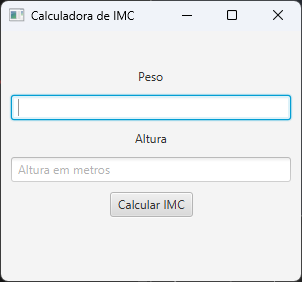

# Calculadora de IMC - JavaFX

Projeto desenvolvido em Java utilizando JavaFX.

## 📷 Preview da Aplicação

## Sobre o projeto

Aplicação desktop que calcula o IMC (Índice de Massa Corporal) com base em peso e altura informados pelo usuário.

## Tecnologias utilizadas

- Java
- JavaFX

## Como executar

Compile:

javac --module-path "caminho/javafx/lib" --add-modules javafx.controls src/ProjetoCalculadoraIMC.java

Execute:

java --module-path "caminho/javafx/lib" --add-modules javafx.controls -cp src ProjetoCalculadoraIMC
